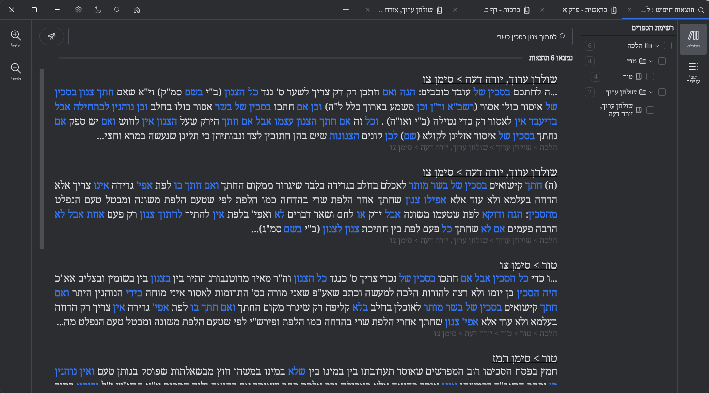

# Zayit - the study library that goes straight to the text

  

Zayit is a free app to read, search, and explore Jewish study texts.
Built for study: fast search, smooth navigation, clean citations.
For review, preparing a lesson, or studying with a partner.

Free. Clear. Efficient.

<table>
  <tr>
    <td align="center" valign="middle">
      
    </td>
    <td align="center" valign="middle">
      
    </td>
  </tr>
</table>

## Vision
Zayit is a dream turned useful: a natural, fluid, almost obvious study experience.
The project will remain free by principle. Support is welcome and meaningful.
It is designed to stay non-commercial.
With God's help, Zayit will keep growing without losing its spirit.

## In the spirit of a study hall
Zayit is designed like a digital study hall: stable, fast, consistent.
You feel the calm of study: everything works, everything is in its place.
The text stays at the center, with respect and without distractions.

## A pro and natural interface
Zayit is built on JetBrains technologies, including Compose Desktop and Jewel.
Inspired by Google Chrome and IntelliJ IDEA, it offers a professional interface
that is fluid and natural, respects study, and does not strain the eyes.
Zayit is easy to use: you already know how, no learning curve.
Everything feels natural, intuitive, and within reach.

## Modular panels
The layout adapts instantly: organize the screen the way you want.
Show, hide, compare, and tailor reading to your study style.

  
  

## An exceptional search engine
A powerful engine designed to understand texts, not just find them.
The database was rebuilt to make search and navigation precise.
Every result helps you move forward on the topic, without wasting time.
Powered by Lucene and enhanced by AI for precision.
It is likely the most powerful engine ever built for this kind of study.
It finds words, forms, and variants with remarkable reliability.
Search is fast, stable, and guides you straight to the right source.

- Find a passage even from a partial word or approximate spelling.
- Even without vocalization or cantillation marks, search stays clear and reliable.
- A partial phrase is often enough to reach the right place.
- Clean, readable, immediate results, useful for review and lesson prep.

Simple to go fast, advanced to go far.

  
  

  
  

## Crafted with care
Zayit aims for quality and consistency: no gimmicks, no noise.
Like a digital study desk, everything is there to move forward.
Every detail is designed for natural, respectful study.
Built to be fast, light, almost magical, it runs even on low-powered machines.

## What Zayit lets you do
- Find a passage in seconds with simple or advanced search.
- Explore a library by book and table of contents without losing the thread.
- Search inside a book to prepare a lesson or review.
- Show commentaries and translations side by side.
- Access sources for a passage quickly.
- Copy a clean excerpt to share in a lesson or with a study partner.
- Switch instantly between light and dark themes.

## Book navigation
Find a book, jump straight to a chapter, and continue your reading.

  
  

  
  

## Search within a book
Like Ctrl+F: you already know how to use it.

  
  

## Commentaries and translations
Choose your commentaries and translations, compare, and move forward in the text.

  
  

  
  

## Sources
Find the origin of a passage at a glance.

  
  

## Copy to clipboard

  
  

## Thanks
Thanks to the projects and libraries that make Zayit possible: JetBrains (Kotlin, Compose Desktop, Jewel),
Apache (Lucene), and all open source authors.
Thanks also to Sefaria and Otzaria for the quality and openness of their databases.

## Sources and rights
Zayit relies on corpora from **[Sefaria](https://www.sefaria.org.il/)** and
**[Otzaria Library](https://github.com/Otzaria/otzaria-library)**, converted to SQL via
**[SeforimLibrary](https://github.com/kdroidFilter/SeforimLibrary)**.
Each work may have its own terms: the user agrees to respect them.
Zayit and its authors cannot be held responsible for non-compliant use.

## Typography
The project includes licensed fonts: **Rashi Amiti** (exclusive to Zayit,
with permission from **[The ImageMaster](https://www.theimagemaster.com/)**) and fonts from the
**[Culmus project](https://culmus.sourceforge.io/)** (their own licenses).

## License and sharing
Zayit is free and open source, published under **[AGPL v3](https://raw.githubusercontent.com/kdroidFilter/SeforimApp/refs/heads/master/LICENSE)**.
Sharing is encouraged - it is a good deed.

---

Zayit is free and open source. For license details, see `LICENSE`.
