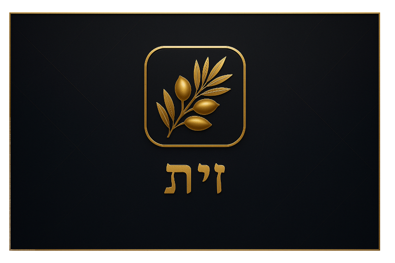
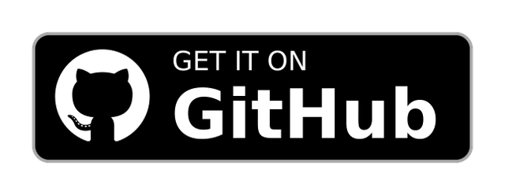
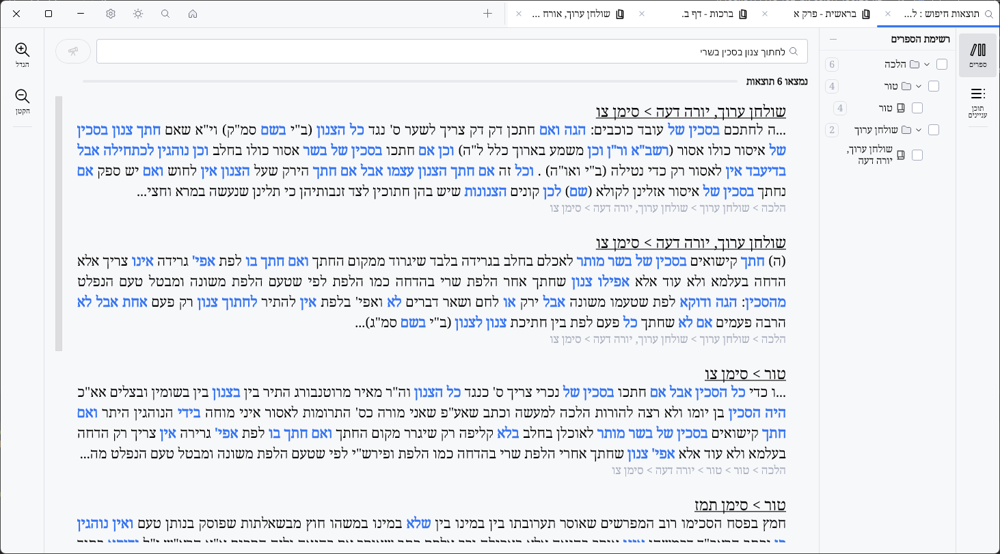
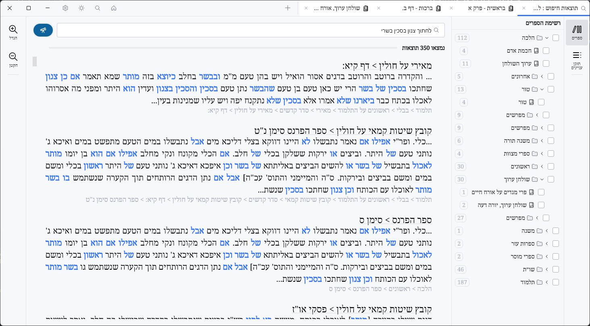
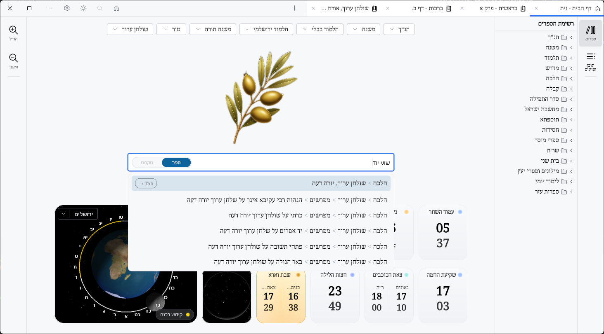
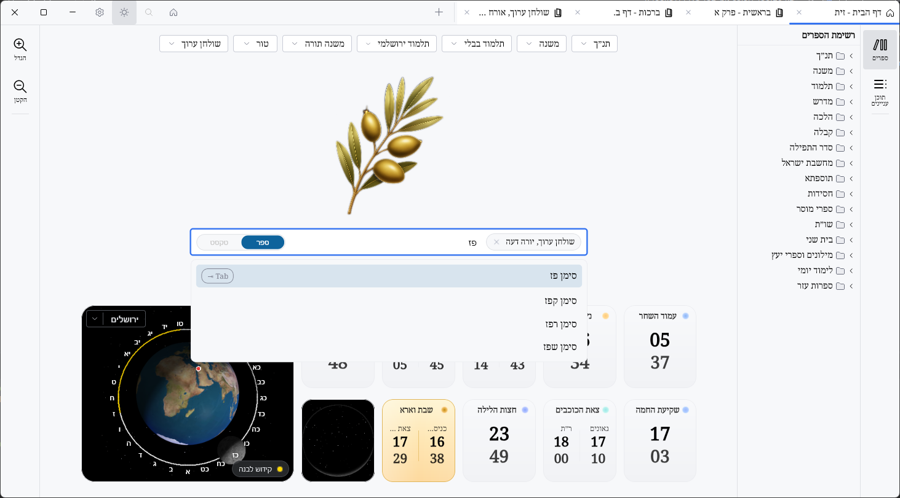
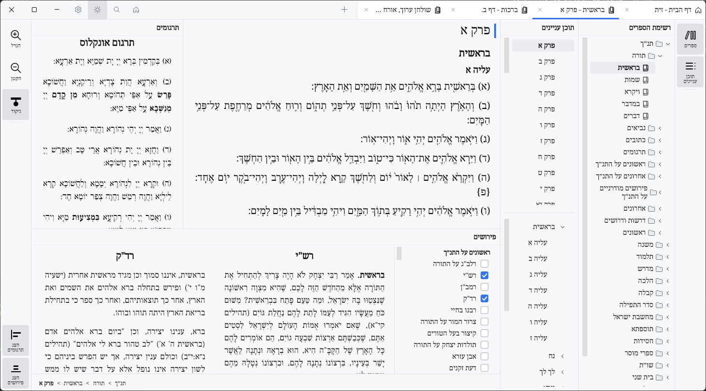
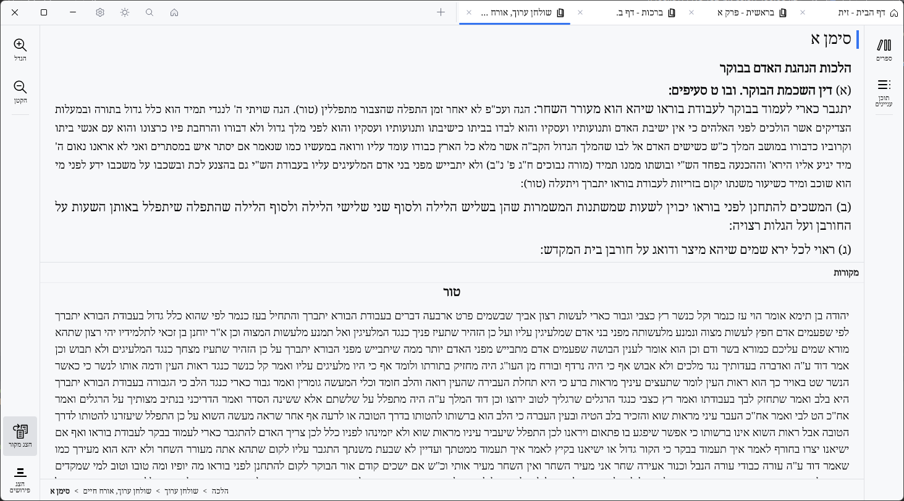

# זית - ספריית הלימוד שמובילה ישר לטקסט

  <a href="README.MD">English</a> | עברית

  

זית היא אפליקציה חינמית לקריאה, חיפוש וסיור בטקסטי לימוד יהודיים.
בנויה ללימוד: חיפוש מהיר, ניווט חלק, ציטוטים נקיים.
לחזרה, הכנת שיעור, או לימוד בחברותא.

חינם. ברור. יעיל.

  
  &nbsp;&nbsp;
  

## חזון
זית היא חלום שהפך לשימושי: חוויית לימוד טבעית, זורמת, כמעט מובנת מאליה.
הפרויקט יישאר חינמי מתוך עיקרון. תמיכה מתקבלת בברכה ובמשמעות.
הוא מתוכנן להישאר לא מסחרי.
בעזרת ה', זית תמשיך לצמוח בלי לאבד את רוחה.

## ברוח בית המדרש
זית מעוצבת כמו בית מדרש דיגיטלי: יציב, מהיר, עקבי.
מרגישים את השקט של הלימוד: הכל עובד, הכל במקומו.
הטקסט נשאר במרכז, בכבוד ובלי הסחות דעת.

## ממשק מקצועי וטבעי
זית בנויה על טכנולוגיות JetBrains, כולל Compose Desktop ו-Jewel.
בהשראת Google Chrome ו-IntelliJ IDEA, היא מציעה ממשק מקצועי
שזורם וטבעי, מכבד את הלימוד ולא מעייף את העיניים.
זית קלה לשימוש: אתם כבר יודעים איך, בלי עקומת למידה.
הכל מרגיש טבעי, אינטואיטיבי, ובהישג יד.

## פאנלים מודולריים
הפריסה מתאימה את עצמה מיד: סדרו את המסך כרצונכם.
הציגו, הסתירו, השוו, והתאימו את הקריאה לסגנון הלימוד שלכם.

<picture>
  <source media="(prefers-color-scheme: dark)" srcset="art/HOME-DARK.png">
  <source media="(prefers-color-scheme: light)" srcset="art/HOME-LIGHT.png">
  
</picture>

## מנוע חיפוש יוצא דופן
מנוע חזק שנבנה להבין טקסטים, לא רק למצוא אותם.
בסיס הנתונים נבנה מחדש כדי להפוך חיפוש וניווט למדויקים.
כל תוצאה עוזרת להתקדם בנושא, בלי לבזבז זמן.
מופעל על ידי Lucene ומשופר על ידי בינה מלאכותית לדיוק.
סביר להניח שזהו המנוע החזק ביותר שנבנה אי פעם ללימוד מסוג זה.
הוא מוצא מילים, צורות וגרסאות באמינות מרשימה.
החיפוש מהיר, יציב, ומוביל ישר למקור הנכון.

- מצאו קטע גם ממילה חלקית או איות משוער.
- גם בלי ניקוד או טעמים, החיפוש נשאר ברור ואמין.
- משפט חלקי לעתים קרובות מספיק כדי להגיע למקום הנכון.
- תוצאות נקיות, קריאות, מיידיות, שימושיות לחזרה והכנת שיעור.

פשוט ללכת מהר, מתקדם ללכת רחוק.

חיפוש פשוט.

<picture>
  <source media="(prefers-color-scheme: dark)" srcset="art/DB-SEARCH-SIMPLE-DARK.png">
  <source media="(prefers-color-scheme: light)" srcset="art/DB-SEARCH-SIMPLE-LIGHT.png">
  
</picture>

חיפוש מתקדם.

<picture>
  <source media="(prefers-color-scheme: dark)" srcset="art/DB-SEARCH-ADVANCED-DARK.png">
  <source media="(prefers-color-scheme: light)" srcset="art/DB-SEARCH-ADVANCED-LIGHT.png">
  
</picture>

## נבנה בקפידה
זית שואפת לאיכות ועקביות: בלי גימיקים, בלי רעש.
כמו שולחן לימוד דיגיטלי, הכל שם כדי להתקדם.
כל פרט מעוצב ללימוד טבעי ומכבד.
בנויה להיות מהירה, קלה, כמעט קסומה, רצה גם על מחשבים חלשים.

## מה זית מאפשרת לכם לעשות
- מצאו קטע בשניות עם חיפוש פשוט או מתקדם.
- חקרו ספרייה לפי ספר ותוכן עניינים בלי לאבד את החוט.
- חפשו בתוך ספר להכנת שיעור או חזרה.
- הציגו פירושים ותרגומים זה לצד זה.
- גשו למקורות של קטע במהירות.
- העתיקו קטע נקי לשיתוף בשיעור או עם חברותא.
- עברו מיידית בין ערכות נושא בהירות וכהות.

## ניווט בספרים
מצאו ספר, קפצו ישר לפרק, והמשיכו בקריאה.

חיפוש ספרים.

<picture>
  <source media="(prefers-color-scheme: dark)" srcset="art/BOOK-SEARCH-DARK.png">
  <source media="(prefers-color-scheme: light)" srcset="art/BOOK-SEARCH-LIGHT.png">
  
</picture>

תוכן עניינים.

<picture>
  <source media="(prefers-color-scheme: dark)" srcset="art/TOC-BOOK-SEARCH-DARK.png">
  <source media="(prefers-color-scheme: light)" srcset="art/TOC-BOOK-SEARCH-LIGHT.png">
  
</picture>

## חיפוש בתוך ספר
כמו Ctrl+F: אתם כבר יודעים איך להשתמש בזה.

<picture>
  <source media="(prefers-color-scheme: dark)" srcset="art/INBOOK-SEARCH-DARK.png">
  <source media="(prefers-color-scheme: light)" srcset="art/INBOOK-SEARCH-LIGHT.png">
  
</picture>

## פירושים ותרגומים
בחרו את הפירושים והתרגומים שלכם, השוו, והתקדמו בטקסט.

פירושים.

<picture>
  <source media="(prefers-color-scheme: dark)" srcset="art/PIRUSHIM-DARK.png">
  <source media="(prefers-color-scheme: light)" srcset="art/PIRUSHIM-LIGHT.png">
  
</picture>

פירושים ותרגומים.

<picture>
  <source media="(prefers-color-scheme: dark)" srcset="art/PIRUSHIM-TARGUMIM-DARK.png">
  <source media="(prefers-color-scheme: light)" srcset="art/PIRUSHIM-TARGUMIM-LIGHT.png">
  
</picture>

## מקורות
מצאו את מקור הקטע במבט אחד.

<picture>
  <source media="(prefers-color-scheme: dark)" srcset="art/MEKOR-DARK.png">
  <source media="(prefers-color-scheme: light)" srcset="art/MEKOR-LIGHT.png">
  
</picture>

## העתקה ללוח
<picture>
  <source media="(prefers-color-scheme: dark)" srcset="art/CLIPBOARD-DEMO-DARK.png">
  <source media="(prefers-color-scheme: light)" srcset="art/CLIPBOARD-DEMO-LIGHT.png">
  
</picture>

## תודות
תודה לפרויקטים ולספריות שמאפשרים את זית: JetBrains (Kotlin, Compose Desktop, Jewel),
Apache (Lucene), וכל מחברי הקוד הפתוח.
תודה גם לספריא ולאוצריא על האיכות והפתיחות של בסיסי הנתונים שלהם.

## מקורות וזכויות
זית נשענת על קורפוסים מ-**[ספריא](https://www.sefaria.org.il/)** ומ-
**[ספריית אוצריא](https://github.com/Otzaria/otzaria-library)**, שהומרו ל-SQL דרך
**[SeforimLibrary](https://github.com/kdroidFilter/SeforimLibrary)**.
לכל יצירה עשויים להיות תנאים משלה: המשתמש מתחייב לכבד אותם.
זית ומחבריה אינם יכולים להיות אחראים לשימוש שאינו תואם.

## טיפוגרפיה
הפרויקט כולל גופנים ברישיון: **רש"י אמיתי** (בלעדי לזית,
באישור מ-**[The ImageMaster](https://www.theimagemaster.com/)**) וגופנים מפרויקט
**[Culmus](https://culmus.sourceforge.io/)** (הרישיונות שלהם).

## רישיון ושיתוף
זית היא חינמית וקוד פתוח, מפורסמת תחת **[AGPL v3](https://raw.githubusercontent.com/kdroidFilter/SeforimApp/refs/heads/master/LICENSE)**.
שיתוף מעודד - זו מצווה.

---

זית היא חינמית וקוד פתוח. לפרטי הרישיון, ראו `LICENSE`.
